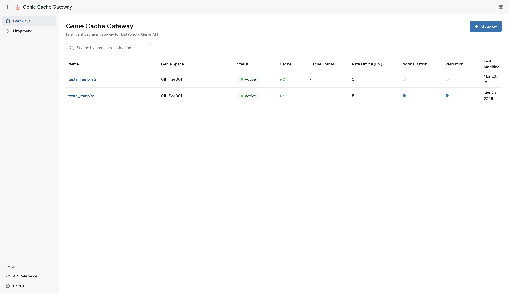
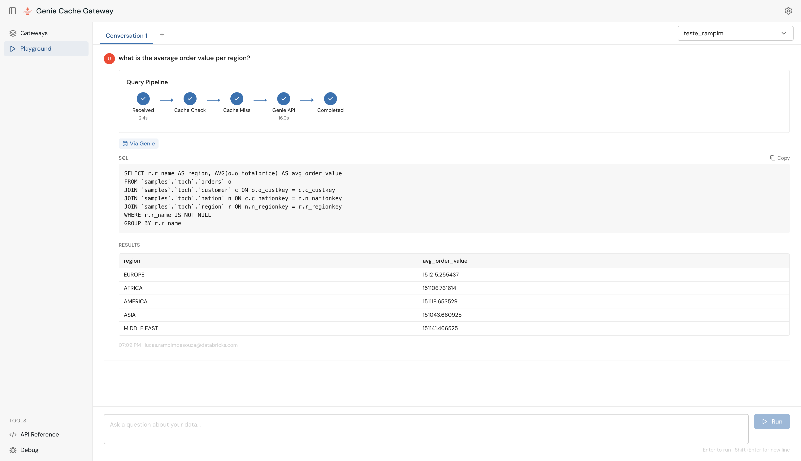
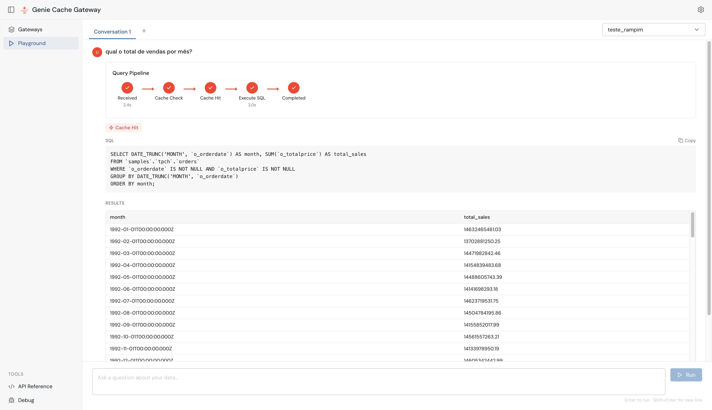
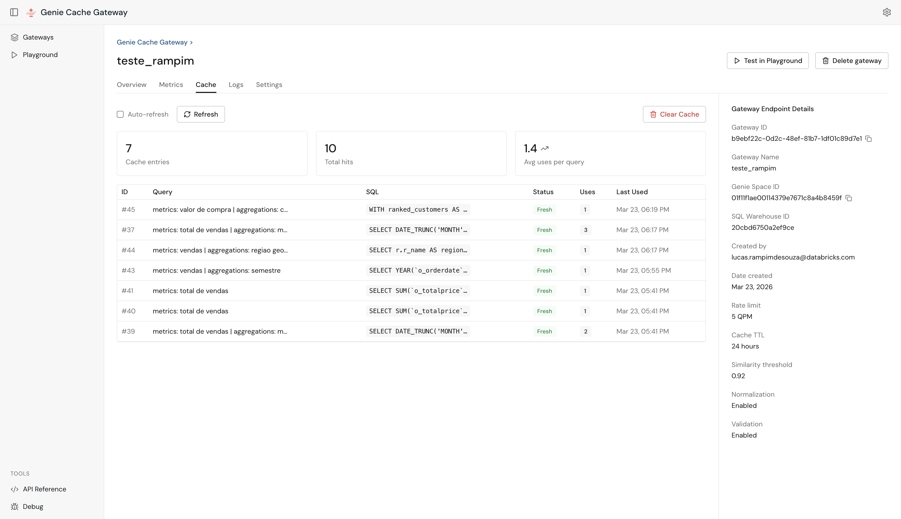
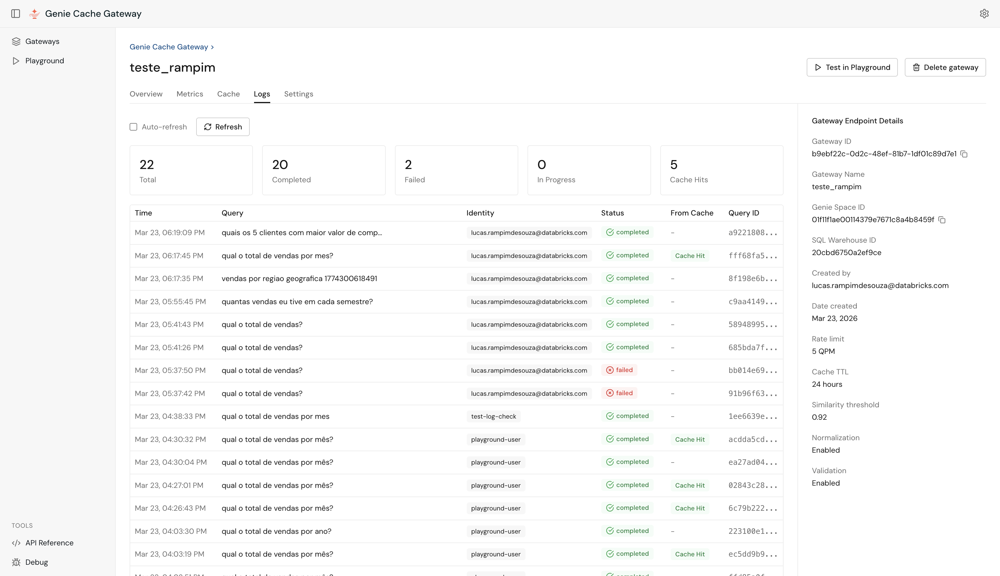
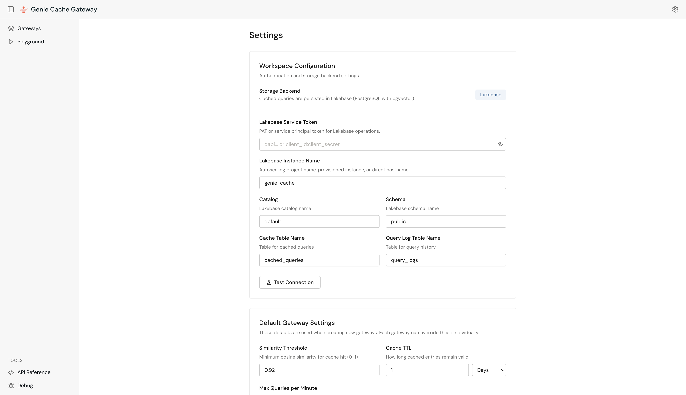
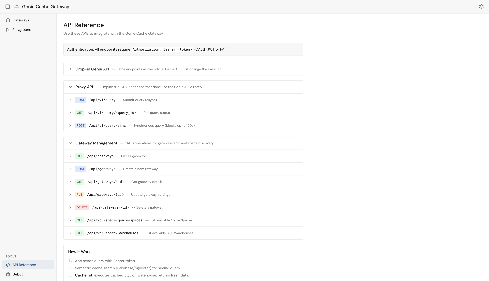

# Genie Gateway

Performance and governance layer for the Databricks Genie API. Deploy as a Databricks App — callers swap the base URL, zero code changes required.

- **Semantic caching** — Similar questions resolve instantly by re-executing the cached SQL against the warehouse (fresh data, sub-second latency)
- **Traffic management** — Built-in queue with automatic retry and exponential backoff for burst workloads
- **Multi-gateway** — Each gateway maps to one Genie Space + SQL Warehouse with independent caches, settings, and access controls

Genie translates natural language to SQL. The Gateway caches that translation so repeated and similar questions skip the NL-to-SQL step entirely and go straight to execution — faster responses, lower compute cost, and higher throughput for production workloads.

## Architecture

```
Caller (OAuth)
    |
    v
App (/api/2.0/genie/* or /api/2.0/mcp/* or /api/v1/ or /api/gateways/)
    |
    +-- Gateway Config (DB)         <-- name, space_id, warehouse_id, settings
    +-- Embedding Service           <-- caller's OAuth (semantic similarity)
    +-- Cache (Lakebase/PGVector)   <-- app SP OAuth, scoped per gateway
    +-- Genie API                   <-- caller's OAuth (on cache miss only)
    +-- SQL Warehouse               <-- caller's OAuth (re-execute cached SQL)
```

## Quick Start

### Prerequisites

- Databricks workspace with **Apps** enabled
- [Databricks CLI](https://docs.databricks.com/dev-tools/cli/install.html) installed and configured
- A **Genie Space** and **SQL Warehouse** in your workspace
- A **Lakebase Autoscaling** project for persistent cache (pgvector)
- Python 3.10+ (**Dash** ships with the backend; Bootstrap CSS loads from CDN)

### 1. Configure the bundle variables

Declarative Automation Bundles deploy the **Databricks App**, bind **Lakebase Postgres** (`postgres`) and **Genie Space** (`genie_space`) resources, and apply **user OAuth scopes** (`sql`, `dashboards.genie`, `serving.serving-endpoints`). Source of truth lives in **`databricks.yml`** and **`resources/genie_gateway.app.yml`**.

1. Confirm `targets.demo.workspace.profile` in `databricks.yml` matches your CLI profile (`databricks configure`).
2. Set **`lakebase_database`** for your Postgres project — full path  
   `projects/<project>/branches/<branch>/databases/<db-id>`. Easiest fixes:
   - Edit `targets.demo.variables` in **`databricks.yml`**, or
   - Override at deploy:  
     `databricks bundle deploy -t demo --auto-approve --var lakebase_database="projects/..."`
3. Set **`genie_space_id`** / **`genie_space_name`** if you bind a different space.

### 2. Deploy (sync code + deploy resources)

From the repo root:

```bash
npm run bundle:deploy
# or:
databricks bundle deploy -t demo --auto-approve
```

Python dependencies (including **Dash**) are installed by the Apps runtime from **`requirements.txt`**.  
UI is mounted at **`/dash/`**.

Code is synced under  
`/Workspace/Users/<you>/.bundle/genie_space_lakebase_cache/demo`  
per `targets.demo.workspace.root_path`.

Validate only:

```bash
npm run bundle:validate
```

Start or refresh the running app workflow after deploy:

```bash
npm run bundle:run
```

> **Scopes:** Bundles declare `dashboards.genie`, `sql`, and `serving.serving-endpoints`. If you change scopes, users must **sign out and back in** (or use a fresh incognito window) so delegated tokens refresh.

<details>
<summary><strong>Optional: CLI deploy without bundles</strong></summary>

If you bypass bundles, replicate the YAML in **`resources/genie_gateway.app.yml`**: PATCH the app with the same **`user_api_scopes`**, **`resources`** (postgres + genie_space), and env var **`GENIE_SPACE_ID`** (`value_from`/`valueFrom`). Then upload source and **`app.yml`**, deploy the app:

```bash
databricks workspace import-dir . /Workspace/Users/<you>/<app-folder> \
  --profile <profile> --overwrite
databricks workspace import "/Workspace/Users/<you>/<app-folder>/app.yml" \
  --file ./app.yml --format RAW --profile <profile> --overwrite
databricks apps deploy <app-name> \
  --source-code-path "/Workspace/Users/<you>/<app-folder>" \
  --profile <profile>
```

After that, complete [Lakebase Setup](#lakebase-setup) (SP CAN_MANAGE + `databricks_create_role`).

</details>

### 3. Create a Gateway

Open the app URL. On the **Gateways** home page, click **+** to create a new gateway:



| Field | Description |
|-------|-------------|
| **Name** | Display name for this gateway (e.g. `Retail Analytics`) |
| **Genie Space** | Select from spaces auto-discovered in your workspace |
| **SQL Warehouse** | Select from available warehouses |
| **Advanced** | Similarity threshold, cache TTL, rate limit, normalization/validation |

### 4. Use the Endpoint

From the gateway's **Overview** tab, copy the ready-to-use endpoint URL:


Change the base URL in your application — everything else stays the same:

```python
# Before (direct Genie API)
BASE = "https://<workspace>.cloud.databricks.com"

# After (via Gateway — cached, queued, same auth)
BASE = "https://<app-name>.aws.databricksapps.com"

# Use gateway ID instead of space ID
r = requests.post(f"{BASE}/api/2.0/genie/spaces/{GATEWAY_ID}/start-conversation",
    headers={"Authorization": f"Bearer {TOKEN}"},
    json={"content": "How many customers?"})
```

---

## Playground

Use the built-in **Playground** to test queries interactively. The pipeline visualizer shows each step in real time.

**Cache Miss** — first time a question is asked, the Gateway calls Genie and caches the SQL translation:



**Cache Hit** — same or similar question resolves instantly from cache:



---

## Gateway Management

Each gateway has a detail page with five tabs.

**Metrics** — cache hit rate, total queries (7-day window), and cache entry count:


**Cache** — all cached queries with SQL, usage count, and freshness:



**Logs** — full query history scoped to this gateway with status and cache hit/miss badge:



**Settings** — per-gateway overrides for threshold, TTL, rate limit, normalization, and validation:


### Gateway Configuration Reference

| Field | Description | Default |
|-------|-------------|---------|
| `name` | Unique display name | Required |
| `genie_space_id` | Databricks Genie Space ID | Required |
| `sql_warehouse_id` | SQL Warehouse for query execution | Required |
| `similarity_threshold` | Cache match threshold (0–1) | 0.92 |
| `cache_ttl_hours` | Cache freshness in hours (0 = unlimited) | 24 |
| `max_queries_per_minute` | Traffic management threshold | 5 |
| `question_normalization_enabled` | Normalize questions before embedding | true |
| `cache_validation_enabled` | Validate cache hits with LLM | true |
| `embedding_provider` | `databricks` or custom endpoint | `databricks` |
| `shared_cache` | Share cache across all users | true |

---

## Global Settings

Configure once in the **Settings** page. These are the **defaults for new gateways** and the **runtime fallback** when a gateway leaves a field unset. Each gateway can override any of these in its own Settings tab.

Global settings are persisted to Lakebase (the `global_settings` table in the app's configured schema), so changes survive redeploys, container restarts, and rollbacks. Only the `lakebase_service_token` is session-scoped (kept in memory) since Databricks Apps inject SP credentials at runtime.



| Field | Description |
|-------|-------------|
| **Lakebase Instance Name** | Autoscaling project name or direct hostname |
| **Lakebase Catalog / Schema** | Usually `default` / `public` |
| **Lakebase Service Token** | The app's built-in SP handles authentication automatically — only set this to override |
| **Embedding Provider** | `databricks` (Foundation Model API) or `local` |
| **Question Normalization** | LLM rewrites questions before embedding to improve cache hit rate |
| **Intent Split** | LLM isolates the latest intent in multi-turn conversations |
| **Cache Validation** | LLM validates cached results are relevant before returning them |
| **Normalization / Intent Split / Validation Model** | Serving endpoint override for each LLM stage. Leave blank to use `databricks-llama-4-maverick` |

---

## Lakebase Setup

Lakebase (pgvector) is the storage backend for all cached queries. Inside Databricks Apps, the app automatically uses its **built-in Service Principal** — no manual credential configuration required.

> **Tip:** Asset Bundles attach the **Postgres** and **Genie Space** app resources and apply **user_api_scopes**, but you still need to grant the app SP **CAN_MANAGE** on the Lakebase project and run **`databricks_create_role`** in Postgres (below) the first time — this is a one-time platform requirement, not something the bundle can execute as your user.

### 1. Grant the App's SP Access to Lakebase

Find the app's SP name in **Workspace Settings > Compute > Apps > your app > Service Principal**, then grant it CAN_MANAGE:

```python
from databricks.sdk import WorkspaceClient
from databricks.sdk.service.iam import AccessControlRequest, PermissionLevel

w = WorkspaceClient()
w.permissions.update('database-projects', '<project-name>',
    access_control_list=[
        AccessControlRequest(
            service_principal_name='<app-sp-display-name>',
            permission_level=PermissionLevel.CAN_MANAGE
        )
    ])
```

### 2. Create the SP's PostgreSQL Role

Connect to Lakebase as a human user and run (replace `<app-sp-client-id>` with the app's SP client ID):

```sql
CREATE EXTENSION IF NOT EXISTS databricks_auth;
SELECT databricks_create_role('<app-sp-client-id>', 'SERVICE_PRINCIPAL');
```

> **Important:** Use `databricks_create_role()` — not `CREATE ROLE`. Only `databricks_create_role` enables OAuth JWT authentication. See: [Create Postgres roles](https://docs.databricks.com/aws/en/oltp/projects/postgres-roles)

**Custom schema (recommended):** Configure `LAKEBASE_SCHEMA` in `app.yml` (e.g., `genie_cache_queue`). The app creates the schema on startup and the SP owns it — no manual GRANTs needed. Requires that the SP has `CAN_MANAGE` on the Lakebase project.

**`public` schema (default):** The SP cannot own the `public` schema, so you must grant access manually:

```sql
GRANT ALL ON SCHEMA public TO "<app-sp-client-id>";
GRANT ALL ON ALL TABLES IN SCHEMA public TO "<app-sp-client-id>";
GRANT ALL ON ALL SEQUENCES IN SCHEMA public TO "<app-sp-client-id>";
ALTER DEFAULT PRIVILEGES IN SCHEMA public GRANT ALL ON TABLES TO "<app-sp-client-id>";
ALTER DEFAULT PRIVILEGES IN SCHEMA public GRANT ALL ON SEQUENCES TO "<app-sp-client-id>";
```

> **Note:** Do not create the cache tables manually. Let the app create them on first use. If tables were already created by a different user, drop them first so the app's SP recreates them as owner.

### 3. Configure in Settings

Set the **Lakebase Instance Name** in the Settings page. The app creates the required tables (cache, query_logs, gateways) automatically on first use.

### Local Development

For local development (outside Databricks Apps), configure the **Lakebase Service Token** in Settings or `.env`:
- **Service Principal:** `<client_id>:<client_secret>` (always use SP credentials — never PATs)

---

## Authentication

| Component | Token | Source |
|-----------|-------|--------|
| Genie API | Caller's OAuth | `X-Forwarded-Access-Token` (browser) or `Authorization: Bearer` (API) |
| SQL Warehouse | Caller's OAuth | Same |
| Embeddings | Caller's OAuth | Same |
| **Lakebase cache** | **App's built-in SP** | Auto-detected from `DATABRICKS_CLIENT_ID`/`SECRET` |

**Callers don't need Lakebase access.** The app's SP handles all cache operations transparently.

---

## MCP Server (Model Context Protocol)

Compatible with the [Databricks managed Genie MCP](https://docs.databricks.com/aws/en/generative-ai/mcp/managed-mcp) — same protocol, with caching and traffic management built in. Any MCP client that supports Streamable HTTP can connect.

```
Before:  https://<workspace>.cloud.databricks.com/api/2.0/mcp/genie/{space_id}
After:   https://<app-name>.aws.databricksapps.com/api/2.0/mcp/genie/{gateway_id}
```

The server exposes two tools per gateway (identical to the managed MCP):

| Tool | Description |
|------|-------------|
| `query_space_{gateway_id}` | Ask a natural language question. Cached queries resolve instantly. |
| `poll_response_{gateway_id}` | Poll for the result of a pending query. |

**Example — OpenAI Agents SDK:**

```python
from agents import Agent, Runner
from agents.mcp import MCPServerStreamableHttp

async with MCPServerStreamableHttp(params={
    "url": f"{APP_HOST}/api/2.0/mcp/genie/{GATEWAY_ID}",
    "headers": {"Authorization": f"Bearer {TOKEN}"},
}) as mcp:
    agent = Agent(name="analyst", model=model, mcp_servers=[mcp])
    result = await Runner.run(agent, "Top 3 nations by revenue?")
```

> **Tip:** Enable **Question Normalization** on the gateway when using MCP. Agents may rephrase the same intent differently across calls — normalization maps variations to a canonical form before embedding, improving cache hit rates.

---

## API Reference

Three API families are available. Full documentation is built into the app:



### Clone API (Drop-in Replacement)

All endpoints mirror the official [Databricks Genie API](https://docs.databricks.com/api/workspace/genie). Use the **gateway ID** where you would normally use the Genie Space ID:

| Method | Path | Description |
|--------|------|-------------|
| POST | `/api/2.0/genie/spaces/{gateway_id}/start-conversation` | Start conversation (cache + queue) |
| POST | `.../conversations/{cid}/messages` | Follow-up message |
| GET | `.../conversations/{cid}/messages/{mid}` | Poll for result |
| GET | `.../messages/{mid}/attachments/{aid}/query-result` | Get query data |
| POST | `.../messages/{mid}/attachments/{aid}/execute-query` | Re-execute query |
| GET | `/api/2.0/genie/spaces/{gateway_id}` | Space metadata (proxied) |

### Proxy API (REST)

Simplified REST API for external applications:

| Method | Path | Description |
|--------|------|-------------|
| POST | `/api/v1/query` | Submit query (async) |
| GET | `/api/v1/query/{id}` | Poll query status |
| POST | `/api/v1/query/sync` | Submit and wait (up to 120s) |
| GET | `/api/v1/health` | Health check |
| GET | `/api/v1/cache` | List cached queries |
| GET | `/api/v1/queue` | List queued queries |
| GET | `/api/v1/query-logs` | Recent query logs |

### Gateway Management API

| Method | Path | Description |
|--------|------|-------------|
| GET | `/api/gateways` | List all gateways (with stats) |
| POST | `/api/gateways` | Create a new gateway |
| GET | `/api/gateways/{id}` | Get gateway details |
| PUT | `/api/gateways/{id}` | Update gateway settings |
| DELETE | `/api/gateways/{id}` | Delete a gateway |
| GET | `/api/gateways/{id}/metrics` | Cache hit rate, total queries, cache entries |
| GET | `/api/gateways/{id}/cache` | List cached queries for this gateway |
| DELETE | `/api/gateways/{id}/cache` | Clear cache for this gateway |
| GET | `/api/gateways/{id}/logs` | Query logs scoped to this gateway |
| GET | `/api/workspace/genie-spaces` | List available Genie Spaces |
| GET | `/api/workspace/warehouses` | List available SQL warehouses |
| GET | `/api/workspace/serving-endpoints` | List available LLM serving endpoints |
| GET | `/api/settings` | Get global settings |
| PUT | `/api/settings` | Update global settings |
| POST | `/api/settings/test-connection` | Test Lakebase connection |

---

## Local Development

```bash
cd backend
cp .env.example .env              # Edit with your DATABRICKS_TOKEN, etc.
pip install -r ../requirements.txt
python -m uvicorn app.main:app --reload --port 8000
```

Open **http://127.0.0.1:8000/dash/** (FastAPI redirects `/` → `/dash/`).

## Demo Notebook

The included `demo_notebook.ipynb` runs 7 concurrent queries to demonstrate the Gateway's performance:
1. **First run** — all queries complete with automatic queuing and traffic management
2. **Second run** — all queries served from cache with sub-second latency

Before running, upload `.env.example` to your Workspace home and fill in your values:

```bash
databricks workspace import /Workspace/Users/<your-email>/.env \
  --file .env.example --format RAW --profile <profile>
```

The notebook auto-detects your username and loads the `.env` from there.

## Continuous Deployment

```bash
# Re-deploy after code / bundle config changes
npm run bundle:deploy
# Or: databricks bundle deploy -t demo --auto-approve

# View logs (use the app name from databricks.yml → var app_name)
databricks apps logs genie-cache-demo --follow --profile group-demo
```

## Credits

This project is based on [genie-lakebase-cache](https://github.com/databricks-field-eng/genie-lakebase-cache) by Sean Kim.
